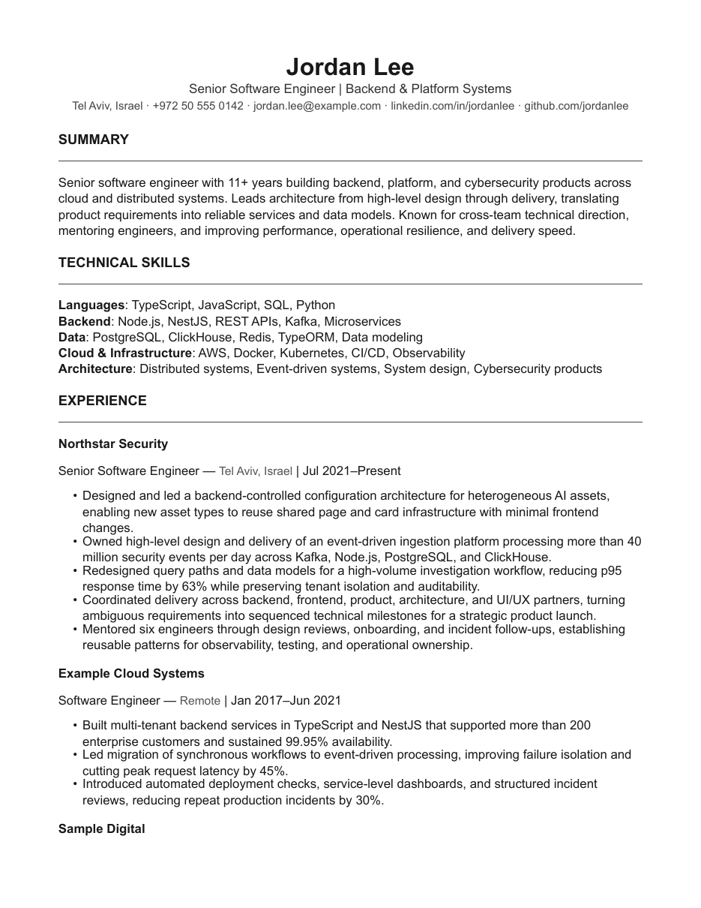
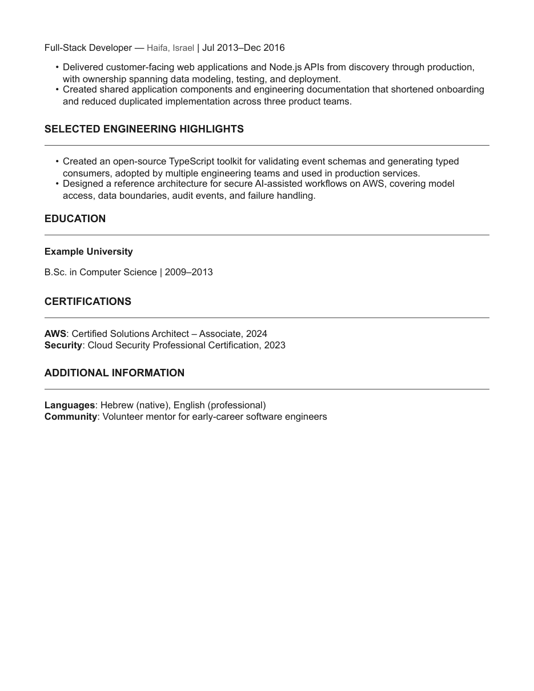

# David Resume Template v1

An open-source, evidence-informed, ATS-first resume framework for experienced professionals.

It prioritizes reliable parsing, rapid human scanning, evidence-dense accomplishments, and maintainability. It deliberately avoids sidebars, icons, skill bars, profile photos, charts, and decorative graphics.

## What makes it different

This repository documents not only how to build a resume, but why the framework uses its structure. Recommendations are separated into robust constraints, context-dependent practices, and aesthetic preferences.

## Design principles

- Single-column, reverse-chronological structure
- US Letter by default; A4 supported
- 11 pt body text and restrained hierarchy
- 18 mm margins (approximately 0.7 inches)
- Standard, explicit section names
- Contact information in the document body
- Selectable-text PDF output
- Flexible optional sections
- No keyword stuffing or hidden text

## Quick start

Install [Typst](https://typst.app/docs/), then run:

```bash
typst compile --root . examples/generic/resume.typ examples/generic/resume.pdf
```

Edit `examples/generic/resume.typ`. The reusable framework lives in `template/resume.typ`.

> **Typst compatibility note:** `context` is a reserved Typst keyword and cannot be used as a dictionary field name. This framework uses `description` for optional role or entry context.

## Canonical example

The repository contains one fictional senior-software-engineering example at [`examples/generic`](examples/generic). It demonstrates a positioning summary, categorized technical skills, reverse-chronological experience, architecture and leadership evidence, measurable bullets, engineering highlights, education, certifications, languages, and community work.

The figures are fictional. Replace them with truthful evidence rather than copying claims.

## Preview

[Download the generated example PDF](examples/generic/resume.pdf).





## Optional sections

The `sections` parameter supports:

- `kind: "bullets"` for Projects, Awards, Publications, Speaking, or similar lists
- `kind: "labeled"` for Certifications, Languages, Tools, or compact metadata
- `kind: "entries"` for dated roles such as Volunteering or Military Service
- custom Typst content for other needs

Include only sections that improve fit for the target role.

Use `featured_sections` for strong Projects, Open Source, Publications, or Architecture Highlights that should appear before Education. Use `sections` for Education-following material such as Certifications, Languages, or additional details.

## Use A4

Pass `page_size: "a4"` to `resume.with(...)`.

## Documentation

- [`Design principles`](docs/design-principles.md)
- [`ATS guidance`](docs/ats-research.md)
- [`Typography`](docs/typography.md)
- [`Section order`](docs/section-order.md)
- [`Impact bullets`](docs/quantified-bullets.md)
- [`Detailed rationale`](docs/design-rationale.md)

## ATS validation checklist

After generating the PDF:

1. Select all text and paste it into a plain-text editor.
2. Verify that reading order is correct.
3. Confirm that contact details and dates are extractable.
4. Check for clipped text and unexpected page breaks.
5. Keep a DOCX fallback when an employer specifically requests it.

## License

MIT. See [`LICENSE`](LICENSE).
